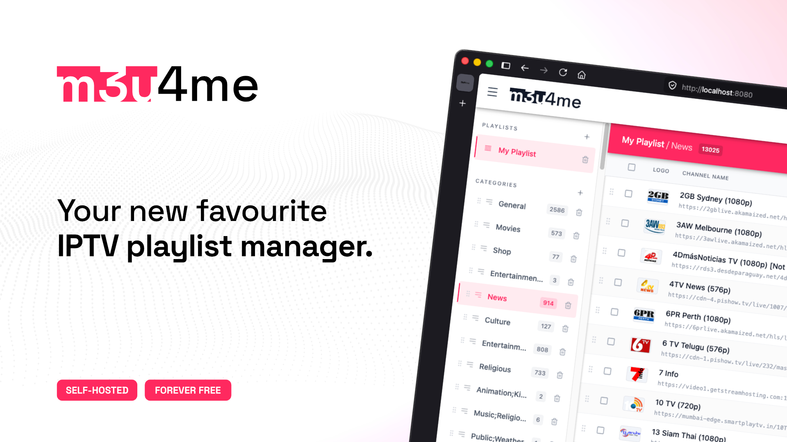

<p align="center">

</p>
<h3 align="center">m3u4me: Self-hosted M3U playlist manager</h3>
<p align="center">
m3u4me is your IPTV playlists' new home. Your streams don't leave your local network, you are in charge, nobody can see or control your playlists.
</p>
<br/>

> [!WARNING]
> m3u4me does NOT provide ANY streams! It is purely a M3U playlist manager. You must bring your own content.

> [!NOTE]
> This app aims to be a self-hosted alternative to https://m3u4u.com/ - as you can see, m3u4me's name is obviously referencing them. The projects are not related in any way. No harm intended!

## AI Disclosure

> [!NOTE]
> This app's code was AI-generated, with minor interventions from me. I am a graphic designer with very limited coding knowledge; I do not support pointless usage of AI and I am fully aware of the harm it can cause. <br/><br/> m3u4me started out as something that was intended only for personal use - I am sharing it only because I believe it is an useful app which might help many other IPTV enthusiasts. <b>It will always be entirely free</b>. <br/><br/> I fully encourage any developer who comes across this app and wants to turn it into something human-made, without AI involvement. </br></br> AI was not used for <b>anything</b> else besides writing the actual code of the app.

[](https://www.gnu.org/licenses/gpl-3.0)

## Features
- <b>Multiple playlist support:</b> Add as many playlists as you like. Start empty or import an M3U or XSPF playlist from a URL or an uploaded file.
- <b>Channel pool sources:</b> Connect your Xtream Codes account, a playlist URL, or an M3U/XSPF file; then browse, search and add channels into any playlist. Each source refreshes on its own schedule and keeps a changelog of what got added, removed or renamed.
- <b>EPG guide:</b> Add EPG sources from an XMLTV URL or an Xtream Codes account, each on its own refresh interval. Browse a live programme timeline and assign TVG IDs to your channels by hand, in bulk via automatic fuzzy name-matching, or one by one.
- <b>Logo editing:</b> Add/edit/remove your channels' logos.
- <b>Stream checker</b> (Not recommended): Basic stream checking functionality, not recommended due to some IPTV providers not reacting nicely to any sort of bulk checking. Use at your own risk!
- <b>Bulk actions:</b> Move, delete, find & replace, or check multiple channels at once.
- <b>Auto-saving:</b> You don't need to remember to save your changes or push your playlist. Everything happens instantly, automatically.
- <b>Undo delete:</b> Deleted a channel by mistake? Hit the "Undo" button which appears on the bottom of your screen and bring it back without a hassle.
- <b>Simple playlist link structure:</b> No more typing huge links on your TV. Playlists get assigned a numerical ID, which means that your download links look like this: http://IP:port/1 for your first playlist, http://IP:port/2 for the second one, and so on. Each playlist also gets its own EPG feed at http://IP:port/{number_ID}/epg.
- <b>Global search:</b> Search across every playlist, channel pool source, and EPG source at once.
- <b>Keyboard shortcuts</b>: Delete your channels with `DEL`, select everything with `Cmd+A`, make your work easier overall. Full list of commands is available inside the app.

### Cosmetic UI features:
- <b>Light mode, Dark mode & AMOLED Dark mode</b>
- <b>Custom accent colours:</b> Even the browser tab's favicon matches your chosen colour.
- <b>Channel logo background colour presets</b>: Choose between light gray, white, black or transparency. <i>(Only for previewing. Does not affect the actual logos in the playlist.)</i>
- <b>Hide stream URLs</b>: Useful for sharing screenshots.
- <b>12-hour or 24-hour time</b>: Pick your preferred clock format for the EPG guide.

## Installation
> [!NOTE]
> m3u4me has been tested on macOS (Apple Silicon) and Debian, running with as little as 512MB of RAM.

There are three ways to install m3u4me. The first one is by far the easiest.

### Option 1: One-line install (recommended)
For Linux servers running systemd that install software with `apt` or `dnf`: Debian, Ubuntu, Fedora, and Proxmox containers based on them.
```
curl -fsSL https://raw.githubusercontent.com/andrei-savin/m3u4me/main/install.sh | sudo bash
```
This command installs Node.js if it is missing, downloads the latest release, builds the app, and sets it up to start automatically whenever your server boots. When it is done, it prints the address where you can open m3u4me.

To use a port other than 8080:
```
curl -fsSL https://raw.githubusercontent.com/andrei-savin/m3u4me/main/install.sh | sudo PORT=9090 bash
```
(Obviously, replace 9090 with your desired port.)

This only works on the first install. To change the port later, edit `/etc/m3u4me.env` and run `sudo m3u4me restart`.

> [!NOTE]
> Piping a script into `sudo bash` means trusting it. [install.sh](install.sh) is deliberately commented so you can read the whole thing first. Here is everything it changes on your system:
> - Installs git and curl if they are missing.
> - Installs Node.js if it is missing or too old. It comes from [NodeSource](https://github.com/nodesource/distributions), whose package repository is added to your system so Node.js keeps getting updates.
> - Puts m3u4me in `/opt/m3u4me` and runs it as a locked-down `m3u4me` user, through one systemd service.
> - Saves the port in `/etc/m3u4me.env` and adds the `m3u4me` command to `/usr/local/bin`.

Once it is installed, you get an `m3u4me` command:

| Command | What it does |
| --- | --- |
| `sudo m3u4me update` | Update to the newest release and restart |
| `m3u4me status` | Check whether m3u4me is running |
| `sudo m3u4me logs` | Watch the live log (Ctrl+C to stop) |
| `sudo m3u4me restart` | Restart m3u4me |
| `sudo m3u4me uninstall` | Remove m3u4me — your playlists are kept |

Your playlists live in `/opt/m3u4me/data`, and the port setting lives in `/etc/m3u4me.env`.

### Option 2: Docker
```
git clone https://github.com/andrei-savin/m3u4me.git
cd m3u4me
docker compose up -d
```
m3u4me will be running at http://localhost:8080. Your playlists are stored in the `data` folder next to `docker-compose.yml`. To use a different port, change it in `docker-compose.yml` and run the last command again.

### Option 3: Manual, with PM2
The original way to run m3u4me. Use this if you would rather set everything up yourself.

<b>1. Install Node.js</b><br/>
m3u4me needs <b>Node.js 22.18 or newer</b>. The official website is pretty straightforward about installing it: https://nodejs.org/en/download.<br/>After installing, make sure it worked by running `node -v` in your terminal — it should print v22.18.0 or higher.

<b>2. Install PM2</b><br/>
This keeps your app running 24/7 in the background.
```
npm install -g pm2
```
<b>3. Clone the source via git:</b>
```
git clone https://github.com/andrei-savin/m3u4me.git
```
<b>4. Navigate into the folder:</b>
```
cd m3u4me
```
<b>5. Install the dependencies:</b>
```
npm ci
```
m3u4me runs on port 8080 by default. You can change that in `ecosystem.config.cjs`.

<b>6. Build the app:</b>
```
npm run build
```
<b>7. Start up PM2:</b>
```
pm2 start ecosystem.config.cjs
```
All done! You can now use m3u4me at http://localhost:8080 [replace `localhost` with the IP of your server, and `8080` with whatever custom port you set up earlier].

<b>8. Make m3u4me auto-run at startup (optional):</b>
```
pm2 startup
pm2 save
```

## Updating

### If you used the one-line install
```
sudo m3u4me update
```
That is the entire update. It fetches the newest release, rebuilds the app, restarts it and checks that it is running. If the new version fails to build or does not start, it automatically puts the previous version back.

### If you use Docker
```
git pull --ff-only
docker compose up -d --build
```

### If you installed manually with PM2
<b>1. Navigate into the app's folder</b>
> [!NOTE]
> The folder shown in the command below is only an example.
```
cd /opt/m3u4me
```
<b>2. Pull the latest code from this repo</b>
```
git pull --ff-only
```
> [!NOTE]
> During this step, you might run into the following error:
> `Your local changes to the following files would be overwritten by merge. / package-lock.json / Please commit your changes or stash them before you merge.`
> If so, just run `git restore package-lock.json` and then continue with the following steps.

<b>3. Install any new dependencies</b>
```
npm ci
```
<b>4. Rebuild the app</b>
```
npm run build
```
<b>5. Restart the PM2 process</b>
```
pm2 restart ecosystem.config.cjs --update-env
```

## Bug reports & feature requests
If you encounter any AI slop, or other sort of error, feel free to create a GitHub issue. I will reply ASAP.
</br>You can also open issues for any feature requests. However, I can not guarantee that they will be accepted.
